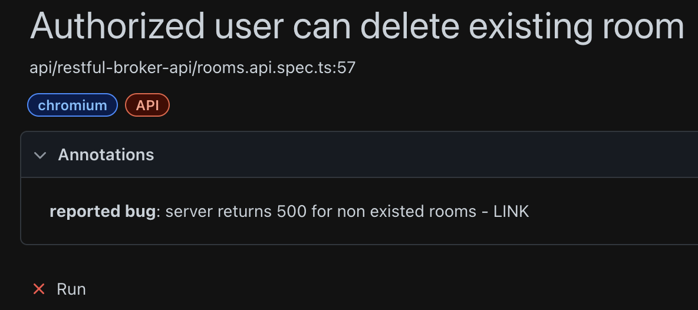

# Introduction to Coding Standards

This guide serves as a reference for the development team, outlining the best practices and conventions to follow when writing code. Consistent coding standards not only enhance the readability of our codebase but also promote collaboration and maintainability.

## Test and test step names

- Test and test step names should start from a capital letter, for example:
  `test("Authenticated user can get resource xyz")`

## Data seeding

If your project requires some predefined data that should exist before test are being executed keep them up to date in some place, if this place differs than testing repo add the link to those pre-requirements in readme file of this repo.

## Use test annotations to mark failing tests

```typescript
  test(
    "Authorized user can delete existing room",
    {
      annotation: {
        type: "reported bug",
        description: "server returns 500 for non existed rooms - LINK",
      },
    } ...
```



## Model Names

- Model names should be written in PascalCase.
- Models should be named in a way that clearly reflects their role or content.

**Examples:**

```typescript
// ✅
interface UserModel { ... }
interface EnvironmentModel { ... }

// ❌
interface userData { ... }
interface data { ... }
```

## Locator Names

- Locator names (UI elements) should be written in camelCase.
- Locators should be named in a descriptive manner that clearly indicates what they represent.

**Examples:**

```typescript
// ✅
openNewTabButton: Locator = this.page.getByRole("link", {
  name: "Open New Tab",
});

// ❌
opTab = this.page.getByRole("link", {
  name: "Open New Tab",
});
```

## Method Names

- Method names should be written in camelCase.
- The method name should follow the format `verbNoun`.
- Method signatures should clearly indicates the purpose of the method.
- Method names should be chosen to clearly describe their action or purpose.

**Examples:**

```typescript
// ✅
function isAuthFileValid(path: string, maxAgeInMilliseconds: number): boolean { ... }

// ❌
function xyz() { ... }
function check() { ... }
```

## AAA (Arrange-Act-Assert)

- Test code should be organized following the AAA principle: Arrange (Preparation), Act (Action), Assert (Assertion).
- Preparation is the stage where we set up test data and conditions.
- Action is the stage where we perform the action being tested.
- Assertion is the stage where we check if the action executed correctly.

**Example:**

```typescript
// ✅
test("Some test description", () => {
  // Arrange
  const expectedText = "xyz";
  const myPage = new myPage();

  // Act
  const result = doSomethingWithData(data);

  // Assert
  expect(myPage.productDescriptionText).toBe(expectedText);
});
```

## File Names

Name files with `kebab-case` aka `dash-case`.

E.g. `context-choice.page.ts`, `main-menu.component.ts` etc.

Use following file extensions to keep consistency:

- tests: `*.spec.ts`
- page objects: `*.page.ts`
- models: `*.model.ts`
- components: `*.component.ts`

## More good practices

New coding standards will be added when the framework develops, if you are not sure how to handle something please ask the test team or check the AirBnb guidance: https://github.com/airbnb/javascript
